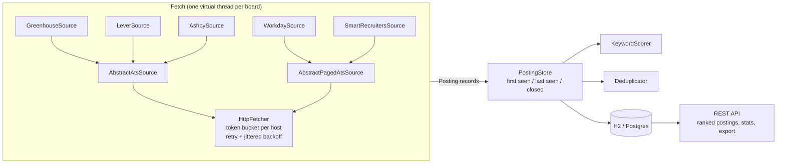

# JobRadar

JobRadar collects job postings from public company job boards, normalizes them into one model, deduplicates them,
ranks them against a skills profile, and tracks each posting's lifecycle over time. It answers questions like:
- which companies are hiring for a given skill;
- which skills are in demand right now;
- how long postings stay open.

Java 21, Spring Boot 4.1, Spring Data JPA (H2 or Postgres), Flyway, JUnit 5, Mockito, WireMock and Testcontainers.

| | |
|---|---|
| Sources | Greenhouse, Lever, Ashby, Workday, SmartRecruiters (public, unauthenticated board APIs) |
| Full crawl | 51 boards, ~11,770 postings, 84-94 s, at 2 requests/s per host |
| Ingest speedup | virtual threads 2.7x faster than sequential with rate limiting, 9.9x without (45 boards) |
| Profiling win | re-sync persistence 14.6 s -> 3.2 s after a JFR profile |
| Dedup precision | 94.0% (Wilson 95%: 83.8-97.9%) on a held-out, LLM-labeled 100-pair sample (78% -> 86% -> 94% over three rounds) |
| API (H2, c=10) | ranked list p50 2 ms / p95 5 ms; cached stats p50 under 1 ms |
| Tests | 265, 96.8% line / 88.1% branch coverage (CI gate 90% / 80%) |

How each number was measured, with the raw data, is in [docs/BENCHMARKS.md](docs/BENCHMARKS.md).

## How it works



1. **Sources.** `JobSource` is the strategy interface: one implementation per ATS, each mapping its own JSON into
   an immutable `Posting` record. Two abstract templates hold the shared mechanics. `AbstractAtsSource` covers
   boards served by a single GET. `AbstractPagedAtsSource` covers paginated boards whose descriptions need one
   detail call per posting (Workday, SmartRecruiters). Adding a provider means one class plus a DTO file.
2. **Fetching.** `IngestService` fans out over boards with a pluggable `FetchStrategy` (sequential, a fixed
   platform-thread pool, or virtual threads). Each board is a fault boundary: a dead board becomes a
   `FetchOutcome.Failure` value and the run continues. Under that, `HttpFetcher` applies:
   - a per-host token bucket (`ReentrantLock`, because JDK 21 virtual threads pin on `synchronized`);
   - retries for 429, 5xx and network errors only, with full-jitter backoff and `Retry-After` honored.
3. **Lifecycle.** The ATS APIs don't say when a posting closed, and their created dates can be years stale. Each
   ingest refreshes the postings still listed, closes the ones that disappeared, and reopens any that come back.
   Absence only counts when the listing is known to be whole:
   - a board whose fetch failed is never synced;
   - a 200 response without a postings collection is treated as an error, not an empty board;
   - a source returns an incomplete `BoardSnapshot` when it skipped an unparseable item or the listing shifted
     while paging, and incomplete snapshots never close anything.
4. **Scoring.** `KeywordScorer` matches a skills dictionary (`skills.yml`, with aliases such as k8s = Kubernetes)
   against a profile. It returns an explainable breakdown: the skills matched, the skills missing, and the title
   signal. Tokenization keeps `C++`, `C#` and `Node.js` intact and doesn't read "go-to-market" as Go.
5. **Dedup.** Exact match on the canonical URL, then a fuzzy match within each company. The fuzzy match requires
   all of: identical title signatures (tokens without stop words, requisition ids or gender markers, lightly
   stemmed), the same level words (Senior, Staff, II), overlapping locations (a city, or for city-less postings
   the most specific region, with remote and office kept apart), and departments that don't conflict. Clustering is leader-based (no transitive chains) and links duplicates
   rather than deleting them.
6. **Read side.** Composable JPA Specifications for filters, RFC 9457 problem responses, cached stats evicted by an
   `IngestCompletedEvent`, and an NDJSON export streamed in batches.

### Design notes

- **Interface plus abstract class.** `JobSource` is the contract callers depend on. The templates are optional
  shared implementation, and the paged one is deliberately a sibling rather than a subclass, because the
  single-GET template doesn't fit it.
- **Records for the domain.** JPA entities stay separate. `Posting` is immutable, and `PostingEntity` is the
  mutable persistence shape; mapping happens in exactly two methods.
- **Sealed types for outcomes.** `SourceException` and `FetchOutcome` are sealed, so `switch` over them is
  checked for exhaustiveness.
- **Persistence stays off the fan-out.** Fetching runs concurrently. Scoring, database writes and dedup run on
  one thread afterwards, with one transaction per board.
- **Ids from sequences, not identity columns.** That lets Hibernate batch inserts.
- **Flyway owns the schema.** Hibernate only validates it. Vendor-specific migrations (`db/vendor/{vendor}`) let
  Postgres have a partial index that H2 can't express.

## API

| Method | Path | Description |
|---|---|---|
| `POST` | `/api/ingest` | Run an ingest. Body (optional): `{"companies": ["stripe", ...], "mode": "SEQUENTIAL" \| "PLATFORM_POOL" \| "VIRTUAL"}`. Returns a report with counts and timings, or 409 if one is already running. |
| `GET` | `/api/postings` | Ranked open, non-duplicate postings. Filters: `minScore`, `since` (date or instant, compared with first seen), `company`, `ats`, `status` (`OPEN`/`CLOSED`/`ALL`), `q` (title), `includeDuplicates`. Also `sort` (`SCORE`/`NEWEST`), `page`, `size` (at most 200). |
| `GET` | `/api/postings/{id}` | One posting with its description, score breakdown, and duplicates |
| `GET` | `/api/companies` | Every configured board, with stored and open counts |
| `GET` | `/api/stats?top=15` | Open postings by ATS, company and workplace type; top skills; new this week; time to close |
| `GET` | `/api/export?minScore=&since=` | NDJSON stream of open postings, for offline analysis |
| `GET` | `/actuator/health`, `/actuator/metrics` | Spring Boot Actuator |

```bash
curl -X POST localhost:8080/api/ingest -H 'Content-Type: application/json' -d '{"companies":["stripe","ramp"]}'
curl 'localhost:8080/api/postings?minScore=0.6&q=backend&size=10'
curl 'localhost:8080/api/stats?top=10'
```

Time to close only counts postings whose opening JobRadar observed, i.e. first seen after the first crawl. It
needs a few weeks of daily crawls before it says anything.

## Running

Requires JDK 21. The Maven wrapper is included.

```bash
./mvnw verify                                  # build + all tests + coverage gate
java -jar target/jobradar-0.0.1-SNAPSHOT.jar   # API on :8080, H2 database in ./data
```

**Your own ranking profile.** Copy `src/main/resources/profile.example.yml` to `./profile.yml` (git-ignored) and
edit the skills and title keywords. The app checks the profile's skills against `skills.yml` at startup.

**Postgres:**

```bash
docker compose up -d                           # set JOBRADAR_PG_PORT if 5432 is taken
java -jar target/jobradar-0.0.1-SNAPSHOT.jar --spring.profiles.active=postgres
```

**One-shot crawl for a scheduler.** The `crawl` profile starts without a web server, ingests every board, and
exits with code 0 if any board was read, 1 if none were.

```bash
java -jar target/jobradar-0.0.1-SNAPSHOT.jar --spring.profiles.active=crawl
```

On Windows, `scripts/windows/install-daily-crawl.ps1 -JarPath ... -DataDir ... -At 07:00` registers a per-user
daily scheduled task. It runs late if the machine was asleep and never runs elevated. It also checks for Java 21+
and pins that `java.exe` for the task. `uninstall-daily-crawl.ps1` removes it. On an always-on server, set
`jobradar.schedule.enabled=true` instead.

**One-shot JSON export.** The `export` profile writes open, non-duplicate postings, with scores and matched
skills, to a JSON file and exits:

```bash
java -jar target/jobradar-0.0.1-SNAPSHOT.jar --spring.profiles.active=export \
  --jobradar.export.file=exports/postings.json --jobradar.export.min-score=0.5
```

On Windows: `scripts\windows\export-postings.cmd <data dir> [min score]`.

**Boards** are listed in `src/main/resources/companies.yml`. Boards move between ATSes, so check them with
`bench/verify-companies.sh`.

## Benchmarks and evaluation

The scripts are in [`bench/`](bench) and the results in [`bench/results/`](bench/results); see
[docs/BENCHMARKS.md](docs/BENCHMARKS.md) for methodology and caveats.

- `./mvnw test -Dtest=IngestBenchmark -Dbench=true`: replay benchmark of the three fetch strategies.
- `bench/live-ingest.sh`: the same comparison against the live APIs.
- `bench/load-test.sh`: API latency with ApacheBench.
- `bench/resync-compare.sh`: before/after comparison of two jars on the same database snapshot.
- `DedupPairSampling` / `DedupEvaluation` (opt-in tests): draw and score dedup labeling samples.

## Being a good API citizen

All five APIs are public job-board endpoints that the companies publish for this kind of use. JobRadar:
- identifies itself in `User-Agent`;
- defaults to 2 requests per second per host;
- retries only failures a retry can fix;
- caps detail calls on paged boards at 50 per board per crawl.

Benchmarks replay recorded payloads instead of re-hitting the APIs.

## Limitations

- The skills dictionary is hand-written. A skill it doesn't list is invisible to scoring and stats.
- Dedup precision on the latest held-out sample is 94%. The remaining errors are titles with the same words but
  different roles ("Senior Manager, Customer Success" vs. "Senior Customer Success Manager"), and truncated Workday
  list titles. It also misses some duplicates whose shared location is only stated in the description (see
  BENCHMARKS).
- Workday's default listing order isn't strictly newest-first, so with detail calls capped, some descriptions fill
  in over several crawls.
